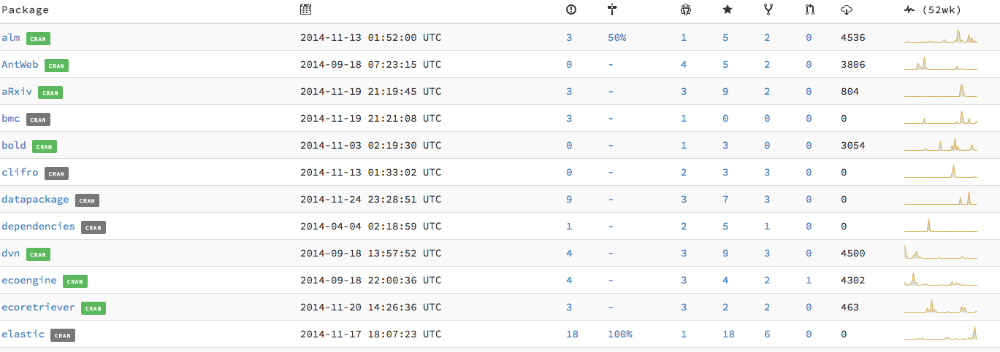

[](https://travis-ci.org/ropensci/dashboard)  
  


# Dashboard

This package provides a simple dashboard for any collection of R projects on GitHub and CRAN. You can cron the script below, ideally no more than 4 times an hour to avoid maxing out the GitHub API limits. CRAN mirror logs update daily.



## Installation

```r
library(devtools)
install_github("metacran/cranlogs")
install_github("ropensci/dashboard")
```

## Example use

```r

library(dashboard)

package <- c("alm","AntWeb","bmc","bold","clifro","dependencies",
            "ecoengine","ecoretriever","elastic","elife","floras",
            "fulltext","geonames","gistr", "jekyll-knitr","mocker",
            "neotoma","plotly","rAltmetric","rAvis","rbhl","rbison",
            "rcrossref","rdatacite","rdryad","rebird","rentrez","reol",
            "reproducibility-guide","rfigshare","rfishbase","rfisheries",
            "rflybase","rgauges","rgbif","rglobi","rhindawi",
            "rinat","RMendeley","rmetadata","RNeXML","rnoaa","rnpn",
            "traits","rplos","rsnps","rspringer","rvertnet","rWBclimate",
            "solr","spocc","taxize","togeojson","treeBASE","ucipp","testdat",
            "git2r","rdat","EML","aRxiv","datapackage","dvn","gender","ggit",
            "gigadb","historydata","ICES","mdextract","ots","paleobioDB",
            "pangaear","prism","rDat","rebi","rnbn","rOBIS","rorcid",
            "RSelenium","sheetseeR","USAboundaries","zenodo")

# Add the GitHub organization/user before each page
# You can also do this manually (and skip this step)
# especially if the packages belong to various accounts
# Or you can run the function below on different vectors and concat the results
pkgs <- add_github(package, "ropensci")

message("Now querying the GitHub API \n")
# Run the stats on all the packages
# You'll need to set up a GitHub app first (one time). 
# See ?github_auth for more details.
results <- lapply(pkgs,github_stats)  %>% Filter(Negate(is.null),.)  
# Finally generate a static html page 
# It writes to the tmp folder by default
# but you can specifiy your own e.g. 
# generate_html(results, path = getwd())
generate_html(results)
```

[](http://ropensci.org)

